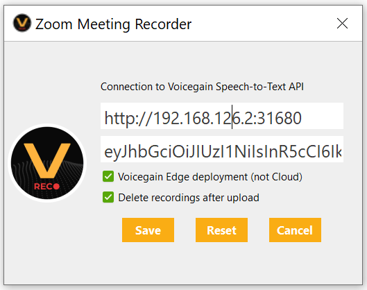
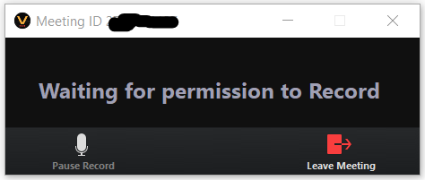
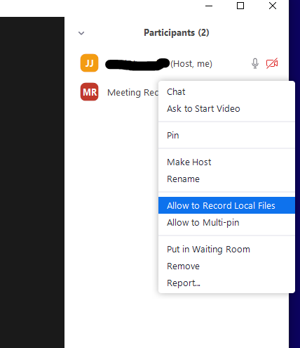
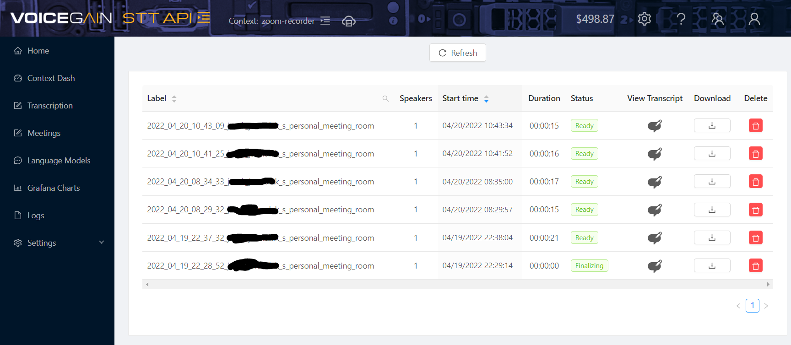

# zoom-recorder
Our Zoom Meeting Recorder does local recording of Zoom meetings (separate recording for each participant) and submits files for transcription to Voicegain. Results of transcription can then be viewed in a Web Console.

## Install

You can download the Windows .msi installer file from [Releases](https://github.com/voicegain/zoom-recorder/releases)

After install you should see shortcuts in the Start Menu and on the Desktop.

## Configuration

When launched for the first time, the App will automatically go to the Settings view and will stay there until you provide settings that allow it to connect to a Voicegain service - either Cloud or Edge.

The image below shows settings suitable to Voicegain Edge service.
* The first value is a base URL of the Voicegain Edge host
* Second line is a JWT obtained from the Edge Voicegain Web Console. We recommend using a separate context for the Zoom Meeting transcription.
  * See our [helpdesk article about JWT](https://support.voicegain.ai/hc/en-us/articles/360028023691-JWT-Authentication) 
* If it is an Edge install you need to make sure that the Edge checkbox is checked.
* Finally, you can choose to have local recording files be automatically removed after a successfull submit for transcription.

When you click Save, the settings will first be tested to see if the necessary Voicegain API requests can be successfully made

## Zoom Meeting Credentials 

Once the test passes you will be switched to a page where you enter Zoom Meeting Id and the Password.

You can enter the Meeting Id and the Password directly, or you can Ctrl+C a Zoom Meeting Join Link, e.g., https://us06web.zoom.us/j/1713580137?pwd=SEdZd017RFdsKztaTlhdWHI2RStTQT09, and it will be automatically pasted into the correct fields on the Zoom Recorder.

## Joining a meeting and enabling recording

Once the meeting parameters have been entered, just click `Join Meeting with ID` to join the meeting.

Zoom Recorder will show up in the meeting as one of the participants with name Meeting Recorder.

In order to start the recording the host of the meeting has to give Meeting Recorder permission to Allow to Record Local Files.

It can be done either in the main video window via a right click  on the pane with "Meeting Recorder"

Or via a right click in the participants list.

And that't it. The recording will start and when the meeting ends (or when you click End Recording) the audio files will be prepared, uploaded, and transcription will start.

## Viewing meetings in Web Console

You will be able to see the recorded Zoom Meetings under the **Meetings** (not the Transcription) in the left hand menu.

Click on the View icon to see the transcript and play back the meeting audio.
